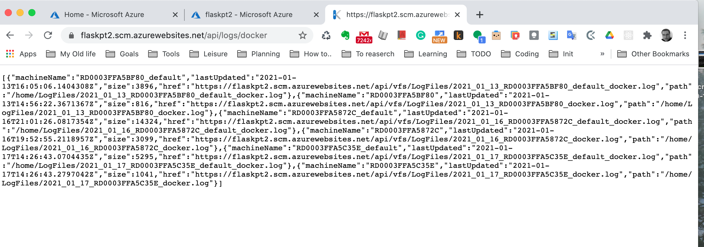

# Overview

This project demonstrates how to implement continuous delivery for a Python-based machine learning application using the Flask web framework with a ML Microservice using Azure DevOps for pipelines, GitHub, and GitHub Actions.

The Machine Learning Microservice has a a pre-trained, sklearn model that has been trained to predict housing prices in Boston according to several features, such as average rooms in a home and data about highway access, teacher-to-pupil ratios, and so on.


## Project Plan
* [A Link to Udacity DevOPS](https://dev.azure.com/jaynronet/UdacityDevOps/_build)
* [A link to a Trello board for the project](https://trello.com/b/b4q2mXEd/udacity-devops)
* [A link to a spreadsheet that includes the original and final project plan]( https://docs.google.com/spreadsheets/d/1rCIJf5hgukItnmcKnGyO6SWcahsT8PYWb-IimWXLv8g/edit#gid=1348135932)


## Instructions

 
* Architectural Diagram (Shows how key parts of the system work)


 Instructions for running the Python project.  How could a user with no context run this project without asking you for any help.  Include screenshots with explicit steps to create that work. Be sure to at least include the following screenshots:

* Project running on Azure App Service

* Project cloned into Azure Cloud Shell


* Passing tests that are displayed after running the `make all` command from the `Makefile`

* Output of a test run


* Successful deploy of the project in Azure Pipelines.  [Note the official documentation should be referred to and double checked as you setup CI/CD](https://docs.microsoft.com/en-us/azure/devops/pipelines/ecosystems/python-webapp?view=azure-devops).


* Running Azure App Service from Azure Pipelines automatic deployment


* Successful prediction from deployed flask app in Azure Cloud Shell.  [Use this file as a template for the deployed prediction](https://github.com/udacity/nd082-Azure-Cloud-DevOps-Starter-Code/blob/master/C2-AgileDevelopmentwithAzure/project/starter_files/flask-sklearn/make_predict_azure_app.sh).
The output should look similar to this:

```bash
udacity@Azure:~$ ./make_predict_azure_app.sh
Port: 443
{"prediction":[20.35373177134412]}
```

* Output of streamed log files from deployed application

> 

## Enhancements

This project could be extended to any pre-trained machine learning model, such as those for image recognition and data labeling. Another minot tweak is to use GitHub actions can be used instead of Azure Pipelines for CD.

## Demo 

<TODO: Add link Screencast on YouTube>


