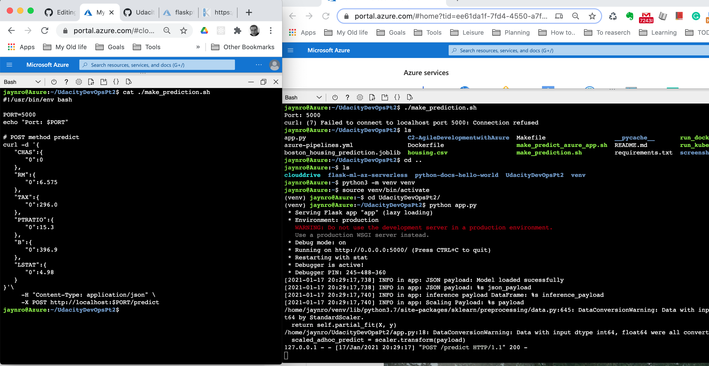

# Overview

This project demonstrates how to implement continuous delivery for a Python-based machine learning application using the Flask web framework with a ML Microservice using Azure DevOps for pipelines, GitHub, and GitHub Actions.

The Machine Learning Microservice has a a pre-trained, sklearn model that has been trained to predict housing prices in Boston according to several features, such as average rooms in a home and data about highway access, teacher-to-pupil ratios, etc.


## Project Plan
* [A Link to the pipelines in Azure DevOPS ](https://dev.azure.com/jaynronet/UdacityDevOps/_build)
* [A link to a Trello board for the project](https://trello.com/b/b4q2mXEd/udacity-devops)
* [A link to a spreadsheet that includes the original and final project plan]( https://docs.google.com/spreadsheets/d/e/2PACX-1vQX4v2XIcWUpBg48i6ql5OYm7QDc4UwDTbR8aYG8lV3KYtMF9z6ycMxStwQDvkFIFsvp6dZzeepOp5B/pubhtml)


## Instructions

 
### Architectural Diagram 


### Run the Flask ML Service in cloud shell

The following steps describe the needed instructions to run this project in Azure cloud shell:

1. Login into Azure Portal & open the cloud shell.
2. Add the SSH keys on GitHub from cloud shell run.
``` ssh-keygen -t ed25519 -C "<your_email_address>@example.com" ```.
3. Go to Github settings -> Add SSH and paste the content generated from above step.
4. Clone the repo using git clone: 


5.Run bellow  commands in the cloud shell to setup and source a Python  virtual environment:
```
python3 -m venv venv
source venv/bin/activate
```

6. Go to the code inside the repo and run the command ``` make install ```- to install requirements
 * Additionally, you can run the make command with the following arguments:
   * Run the command ``` make lint ```- to validate code has no  errors.
   * Run the command ``` make test ``` - to run tests.
   * Run the command ``` make all ``` to execute all above.
    
    
7. Run ``` python3 app.py ``` command to start the flask application.
8. To serve out a prediction,  open another cloud shell session, and then run ``` .\make_predisction.sh ```


 Note: Make sure you have the necesary admin rights to execute this file.

### Build and deploy the Flask ML Service 

1. Make sure  virtual environment and requiered packages are installed (Step 5 and 6 of the previous sections).
2. Deploy the azure web app using  command ``` az webapp up -n flaskpt2 ```.
3. Edit the file make_predict_azure_app.sh with the webapp name you provided above and save the file.
 Note: Make sure you have the necesary admin rights to edit and execute this file.
4. Run ``` ./make_predict_azure_app.sh ``` to servout a prediction result from the Azure WebApp.

 
5. There are 2 ways to check the logs:
   - Running thr  command ``` az webapp log tail ``` in the cloud shell.
   - Openning this URL  https://flaskpt2.scm.azurewebsites.net/api/logs/docker on any browsers.


### Using Github Actions for CI
1. Enable Github Actions and create a new workflow.

2. Update the YML file with below code:
```
name: Python application test with Github Actions

on: [push]

jobs:
  build:

    runs-on: ubuntu-latest

    steps:
    - uses: actions/checkout@v2
    - name: Set up Python 3.5
      uses: actions/setup-python@v1
      with:
        python-version: 3.5
    - name: Install dependencies
      run: |
        make install
    - name: Lint with pylint
      run: |
        make lint
    - name: Test with pytest
      run: |
        make test
```

3. Push a new commit to validate the build will start automatically:


### Using Azure Pipelines for CD
1. Create a project in Azure DevOps.
2. Create a new service connection with your subscription in Project settings.
3. Go to the pipelines of the project and create a new pipeline.
4. Select the repository.
5. Authorize GitHub to use the repository.
6. Select "Python web app for Linux".
7. Add a section on the YAML for lint and test dependencies.
```
    - script: |
        python -m venv antenv
        source antenv/bin/activate
        make install
        make lint
        make test
      workingDirectory: $(projectRoot)
      displayName: "Install, lint and Test"
```
8. Run the YAML file.


## Enhancements

This project could be extended to any pre-trained machine learning model, such as those for image recognition and data labeling. Another minot tweak is to use GitHub actions can be used instead of Azure Pipelines for CD.

## Demo 
* [A Link to a demo for this project ](https://youtu.be/YCNWMz_MqLE)


